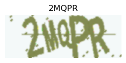
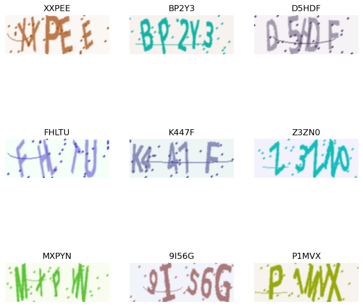
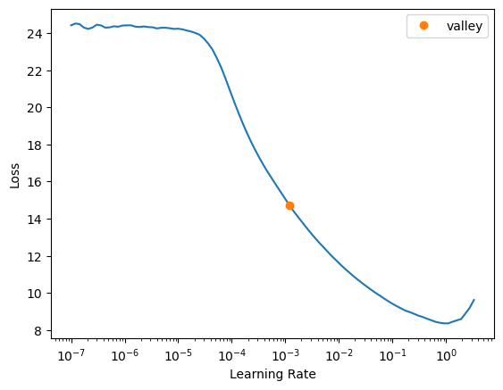
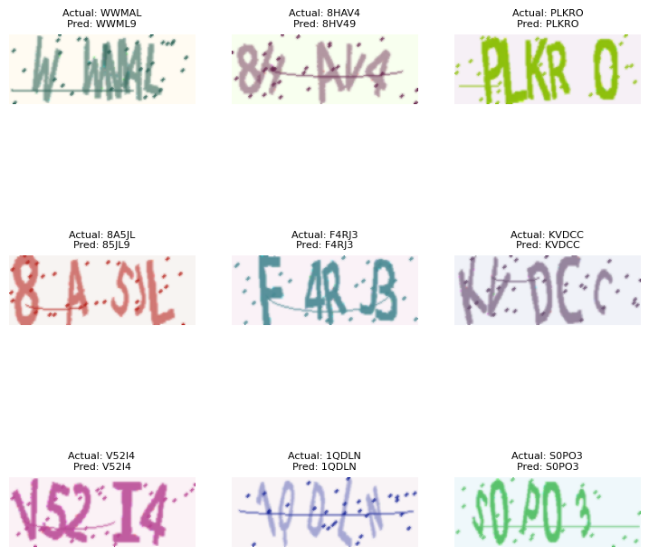

# Breaking CAPTCHAs with Deep Learning: A fast.ai Approach


<!-- WARNING: THIS FILE WAS AUTOGENERATED! DO NOT EDIT! -->

Ever wonder how those distorted text challenges called CAPTCHAs work—and
how we might teach computers to solve them? Today we’re diving into a
practical machine learning project that combines computer vision and
sequence recognition to crack this fascinating problem.

## The Big Picture: Why CAPTCHAs Matter

Before we get into the code, let’s understand what we’re really doing
here. CAPTCHA recognition isn’t just about bypassing security measures
(which you shouldn’t do without permission!). It’s about solving a
fundamental AI challenge: teaching machines to perceive and interpret
visual sequences much like humans do.

This project demonstrates a powerful pattern in machine learning:
**breaking complex problems into specialized sub-tasks**. Rather than
building one massive model to handle everything, we’ll use specialized
components that excel at different aspects of the problem.

## What will we learn today

- Image processing: Handling and transforming image data.

- Deep learning architectures: Combining Convolutional Neural Networks
  (CNNs) for feature extraction and Recurrent Neural Networks (RNNs) for
  sequence processing.

- Specialized loss functions: Like Connectionist Temporal Classification
  (CTC) loss, which is essential for sequence-to-sequence tasks where
  alignment is unknown.

This notebook focuses on building such a model for educational purposes,
demonstrating a powerful approach to sequence recognition in images.

## The Architecture: CNN + LSTM + CTC

Our solution uses three key elements:

1.  **Convolutional Neural Networks (CNNs)** to process the image
2.  **Long Short-Term Memory networks (LSTMs)** to interpret the
    sequence
3.  **Connectionist Temporal Classification (CTC)** to handle alignment
    uncertainty

Let’s see how these pieces work together using fast.ai and PyTorch.

## Objective of this notebook

1.  Generate a synthetic dataset of CAPTCHA images and their
    corresponding text labels.
2.  Preprocess the data into a format suitable for training a deep
    learning model using fastai.
3.  Define and implement a CRNN model architecture tailored for CAPTCHA
    recognition.
4.  Utilize CTC loss for training the model, which handles
    variable-length predictions.
5.  Train the model using fastai’s Learner and best practices like
    learning rate finding and one-cycle policy.
6.  Visualize and evaluate the model’s performance.

``` python
from fastai.vision.all import *
from fastai.text.all import *
from datasets import Dataset
from captcha.image import ImageCaptcha
import random
import string
```

``` python
from src.utils import *
from src.metrics import *
```

# Dataset

``` python
# 2. Create a fake CAPTCHA dataset
def create_captcha_dataset(size=100):
    generator = ImageCaptcha(width=160, height=60)
    data = []
    for _ in range(size):
        label = ''.join(random.choices(string.ascii_uppercase + string.digits, k=5))
        img = generator.generate_image(label)
        data.append({'image': img, 'label': label})  # Using our custom class
    return Dataset.from_list(data)
```

The `create_captcha_dataset` function generates our synthetic CAPTCHA
dataset. It initializes `ImageCaptcha` with a specified width and height
for the images. It then loops `size` times:

A random 5-character label is generated using uppercase letters and
digits. An image is generated for this label. The image and its label
are stored as a dictionary.

Finally, it converts this list of dictionaries into a datasets.Dataset
object, which is a convenient format for handling data.

``` python
# 3. Generate the dataset
ds = create_captcha_dataset(1000)
```

``` python
show_image(ds[0]['image'],title=ds[0]['label'],figsize=(3,5))
```



This line displays the first image from our dataset along with its
label, allowing us to visually inspect what our generated CAPTCHAs look
like.

## Step 1: Creating Our **DataLoaders**

For dataloaders, we need to create data types. Since, we wanted to use
Transformation pipeline which converts tensors from objects and
viceversa. It’s advisable to create a custom Transform to handle labels

``` python
class CaptchaStr(str):
    def show(self, ctx=None, **kwargs):
        return show_title(self, ctx=ctx)

class TokenizeLabel(Transform):
    vocab = list(string.ascii_uppercase + string.digits)
    def __init__(self):
        self.stoi = {v: k for k, v in enumerate(self.vocab)}

    def encodes(self, x: str):
        return TensorText(tensor([self.stoi[c] for c in x]))

    def decodes(self, x: TensorText):
        indices = x.detach().cpu().flatten().tolist()
        return CaptchaStr(''.join(self.vocab[int(i)] for i in indices))
```

``` python
dblock = DataBlock(
    blocks=(ImageBlock, TransformBlock(type_tfms=TokenizeLabel())),
    get_x=lambda o: o['image'],
    get_y=lambda o: o['label'],  # Already a CaptchaLabel instance
    splitter=RandomSplitter(),
    item_tfms=None,
    batch_tfms=[Normalize()]
)

# 7. Create DataLoaders
dls = dblock.dataloaders(ds, bs=16)
```

- `blocks=(ImageBlock, TransformBlock(type_tfms=TokenizeLabel()))`: This
  tells fastai that each item in our dataset consists of two parts: an
  image (handled by ImageBlock) and a label that needs to be processed
  by our TokenizeLabel transform.
  - `get_x=lambda o: o['image']`: A function to extract the input
    (image) from a dataset item o.
  - `get_y=lambda o: o['label']`: A function to extract the target
    (label) from a dataset item o.
  - `splitter=RandomSplitter()`: Specifies that the data should be
    randomly split into training and validation sets.
  - `item_tfms=None`: We are not applying any item-level transforms here
    (like resizing individual images) because our images are already
    generated at the correct size. TokenizeLabel is a type_tfms which
    acts on the type.
  - `batch_tfms=[Normalize()]`: Batch-level transforms are applied to a
    whole batch of data at once. Normalize standardizes the pixel values
    of the images in the batch using ImageNet statistics by default.
  - `dls = dblock.dataloaders(ds, bs=16)`: This line actually creates
    the DataLoaders from our Hugging Face dataset ds with a batch size
    of 16.

``` python
dls.show_batch()
```



## Step 2: The CNN Backbone - Our Visual Feature Extractor

- `CNNBackbone(nn.Module)`: This class defines the Convolutional Neural
  Network part of our CRNN.
  - It consists of four convolutional blocks (conv_block1 to
    conv_block4). Each block typically includes:
    - `nn.Conv2d`: 2D convolution layer to learn spatial features.
    - `nn.BatchNorm2d`: Batch normalization to stabilize and speed up
      training.
    - `nn.ReLU`: ReLU activation function.
    - `nn.MaxPool2d`: Max pooling to downsample the feature maps and
      make the model more robust to variations in position.
    - The comments indicate the change in feature map dimensions after
      each pooling layer.
    - `self.adaptive_pool = nn.AdaptiveAvgPool2d((1, 40))`: This is a
      key layer. After the convolutional blocks, the feature map has a
      certain height and width. This adaptive pooling layer resizes the
      height to 1 while keeping the width at 40 (or forcing it to 40).
      This transforms the 2D feature map into a sequence of feature
      vectors, which is the required input format for the subsequent
      RNN. The output shape will be \[batch_size, num_channels, 1,
      sequence_width\].
    - The forward method defines how input x flows through these blocks.

``` python
# 7. Improved CNN Backbone
class CNNBackbone(nn.Module):
    def __init__(self):
        super().__init__()
        # First conv block (input: 3x60x160)
        self.conv_block1 = nn.Sequential(
            nn.Conv2d(3, 64, kernel_size=3, padding=1),
            nn.BatchNorm2d(64),
            nn.ReLU(inplace=True),
            nn.MaxPool2d(2, 2)  # 60x160 -> 30x80
        )
        # Second conv block
        self.conv_block2 = nn.Sequential(
            nn.Conv2d(64, 128, kernel_size=3, padding=1),
            nn.BatchNorm2d(128),
            nn.ReLU(inplace=True),
            nn.MaxPool2d(2, 2)  # 30x80 -> 15x40
        )
        # Third conv block
        self.conv_block3 = nn.Sequential(
            nn.Conv2d(128, 256, kernel_size=3, padding=1),
            nn.BatchNorm2d(256),
            nn.ReLU(inplace=True),
            nn.Conv2d(256, 256, kernel_size=3, padding=1),  # Added an extra conv layer
            nn.BatchNorm2d(256),
            nn.ReLU(inplace=True),
            nn.MaxPool2d(kernel_size=(2,1), stride=(2,1))  # 15x40 -> 7x40
        )
        # Fourth conv block
        self.conv_block4 = nn.Sequential(
            nn.Conv2d(256, 512, kernel_size=3, padding=1),
            nn.BatchNorm2d(512),
            nn.ReLU(inplace=True),
            nn.Conv2d(512, 512, kernel_size=3, padding=1),  # Added an extra conv layer
            nn.BatchNorm2d(512),
            nn.ReLU(inplace=True),
            nn.Dropout2d(0.2),
            nn.MaxPool2d(kernel_size=(2,1), stride=(2,1))  # 7x40 -> 3x40
        )
        # Reduce height to 1, keep width
        self.adaptive_pool = nn.AdaptiveAvgPool2d((1, 40))  # Force output width to be 40

    def forward(self, x):
        x = self.conv_block1(x)
        x = self.conv_block2(x)
        x = self.conv_block3(x)
        x = self.conv_block4(x)
        x = self.adaptive_pool(x)
        return x
```

Notice how we’re gradually reducing the height while preserving the
width—this transforms the 2D image into a 1D sequence of features,
perfect for our LSTM to process.

## Step 3: The CRNN Model - Combining Vision and Sequence Processing

Now we connect the CNN to an LSTM to handle the sequential nature of
text:

``` python
class CRNN(nn.Module):
    def __init__(self, num_chars):
        super().__init__()
        self.cnn = CNNBackbone()
        # CNN output: [bs, 512, 1, 40]
        lstm_input_size = 512
        hidden_size = 256
        self.num_chars = num_chars

        # Bidirectional LSTM layers
        self.lstm = nn.LSTM(
            lstm_input_size,
            hidden_size,
            num_layers=2,
            bidirectional=True,
            batch_first=False,
            dropout=0.2
        )

        # Initialize LSTM parameters with better values
        for name, param in self.lstm.named_parameters():
            if 'weight_ih' in name:
                nn.init.xavier_uniform_(param)
            elif 'weight_hh' in name:
                nn.init.orthogonal_(param)
            if 'bias' in name:
                nn.init.zeros_(param)
                # Set forget gate bias to 1 (helps with vanishing gradients)
                n = param.size(0)
                param.data[n//4:n//2].fill_(1.0)

        # Output layer
        self.fc = nn.Linear(hidden_size * 2, num_chars + 1)  # +1 for blank

        # Initialize output layer with better values
        nn.init.xavier_uniform_(self.fc.weight)
        nn.init.zeros_(self.fc.bias)

        # CRITICAL: Set bias against blank prediction
        # This helps prevent the "blank collapse" problem
        with torch.no_grad():
            self.fc.bias[num_chars] = -2.0  # Strong negative bias for blank
            # Give a slight positive bias to actual characters
            for i in range(num_chars):
                self.fc.bias[i] = 0.5  # Small positive bias for real characters

    def forward(self, images):
        # Extract CNN features
        features = self.cnn(images)  # [bs, 512, 1, 40]
        bs, C, H, W_seq = features.size()
        assert H == 1, "CNN output height must be 1"

        # Reshape for LSTM: [seq_len, batch_size, features]
        features = features.squeeze(2)      # [bs, 512, 40]
        features = features.permute(2, 0, 1)  # [40, bs, 512]

        # Pass through LSTM
        lstm_out, _ = self.lstm(features)  # [40, bs, 512]

        # Pass through final linear layer
        logits = self.fc(lstm_out)  # [40, bs, num_chars+1]

        # Apply log softmax for CTC loss
        log_probs = F.log_softmax(logits, dim=2)

        # Debug prints - uncomment to see activation distributions
        # print(f"Logits min: {logits.min().item()}, max: {logits.max().item()}, mean: {logits.mean().item()}")
        # print(f"Log_probs min: {log_probs.min().item()}, max: {log_probs.max().item()}, mean: {log_probs.mean().item()}")

        return log_probs
```

## Step 4: CTC Loss - The Special Sauce

The key insight: we don’t know exactly which parts of the image
correspond to which characters. CTC loss solves this alignment problem:

``` python
class CTCLossFlat(nn.Module):
    def __init__(self, blank_token=0, pad_token=-1):
        super().__init__()
        self.blank_token = blank_token
        self.pad_token = pad_token
        self.ctc = nn.CTCLoss(blank=blank_token, reduction='mean', zero_infinity=True)

    def forward(self, log_probs, targets):
        """
        log_probs: [T, B, C] — already in CTC-ready shape
        targets:   [B, S] — padded label indices
        """
        T, B, C = log_probs.shape  # ✅ correct: T = 40, B = 16
    
        # Input lengths = full time steps (T) for each batch
        input_lengths = torch.full((B,), T, dtype=torch.long, device=log_probs.device)
    
        # Target lengths = number of non-pad tokens
        target_lengths = (targets != self.pad_token).sum(dim=1)
    
        # Flatten targets
        targets_flat = torch.cat([t[t != self.pad_token] for t in targets])
    

        return self.ctc(log_probs, targets_flat, input_lengths, target_lengths)

    def activation(self, x):
        return F.log_softmax(x, dim=-1)

    def decodes(self, x):
            if x.ndim == 3: x = x.permute(1, 0, 2)  # [B, T, C]
            preds = x.argmax(-1)  # [B, T]
    
            decoded = []
            for pred in preds:
                tokens = []
                prev = self.blank_token
                for p in pred.cpu().tolist():
                    if p != prev and p != self.blank_token:
                        tokens.append(p)
                    prev = p
                decoded.append(tokens)
            
            # Pad sequences to max length in batch and wrap in TensorText
            max_len = max(len(seq) for seq in decoded)
            padded = torch.full((len(decoded), max_len), self.pad_token, device=x.device)
            for i, seq in enumerate(decoded):
                padded[i, :len(seq)] = torch.tensor(seq, device=x.device)
            
            return TensorText(padded)  # 🔑 Wrap in TensorText
```

## Step 5: Training with fast.ai

``` python
model = CRNN(len(dls.vocab))
loss_func = CTCLossFlat(blank_token = 0)

def split_params(model):
    return [
        params(model.cnn),         # CNN layers - lower learning rate
        params(model.lstm),        # LSTM layers - medium learning rate
        params(model.fc)           # Final layer - higher learning rate
    ]
```

``` python
learn = Learner(
        dls,
        model,
        loss_func=loss_func,
        splitter=split_params,
        metrics=[CTCAccuracy(CTCDecoder(dls.vocab))],
        wd=1e-3  # Reduced weight decay
)
```

``` python
learn.lr_find()
```

<style>
    /* Turns off some styling */
    progress {
        /* gets rid of default border in Firefox and Opera. */
        border: none;
        /* Needs to be in here for Safari polyfill so background images work as expected. */
        background-size: auto;
    }
    progress:not([value]), progress:not([value])::-webkit-progress-bar {
        background: repeating-linear-gradient(45deg, #7e7e7e, #7e7e7e 10px, #5c5c5c 10px, #5c5c5c 20px);
    }
    .progress-bar-interrupted, .progress-bar-interrupted::-webkit-progress-bar {
        background: #F44336;
    }
</style>

    SuggestedLRs(valley=0.0012022644514217973)



``` python
learn.fit_one_cycle(20, 1e-3)
```

<style>
    /* Turns off some styling */
    progress {
        /* gets rid of default border in Firefox and Opera. */
        border: none;
        /* Needs to be in here for Safari polyfill so background images work as expected. */
        background-size: auto;
    }
    progress:not([value]), progress:not([value])::-webkit-progress-bar {
        background: repeating-linear-gradient(45deg, #7e7e7e, #7e7e7e 10px, #5c5c5c 10px, #5c5c5c 20px);
    }
    .progress-bar-interrupted, .progress-bar-interrupted::-webkit-progress-bar {
        background: #F44336;
    }
</style>

<table class="dataframe" data-quarto-postprocess="true" data-border="1">
<thead>
<tr style="text-align: left;">
<th data-quarto-table-cell-role="th">epoch</th>
<th data-quarto-table-cell-role="th">train_loss</th>
<th data-quarto-table-cell-role="th">valid_loss</th>
<th data-quarto-table-cell-role="th">acc</th>
<th data-quarto-table-cell-role="th">time</th>
</tr>
</thead>
<tbody>
<tr>
<td>0</td>
<td>5.699660</td>
<td>3.764331</td>
<td>0.000000</td>
<td>00:02</td>
</tr>
<tr>
<td>1</td>
<td>4.239408</td>
<td>3.723870</td>
<td>0.000000</td>
<td>00:02</td>
</tr>
<tr>
<td>2</td>
<td>3.860534</td>
<td>3.732362</td>
<td>0.000000</td>
<td>00:02</td>
</tr>
<tr>
<td>3</td>
<td>3.752717</td>
<td>3.730798</td>
<td>0.000000</td>
<td>00:02</td>
</tr>
<tr>
<td>4</td>
<td>3.686547</td>
<td>3.760492</td>
<td>0.000000</td>
<td>00:02</td>
</tr>
<tr>
<td>5</td>
<td>3.657431</td>
<td>3.810178</td>
<td>0.000000</td>
<td>00:02</td>
</tr>
<tr>
<td>6</td>
<td>3.580733</td>
<td>3.506015</td>
<td>0.000000</td>
<td>00:02</td>
</tr>
<tr>
<td>7</td>
<td>3.364519</td>
<td>3.111249</td>
<td>0.000000</td>
<td>00:02</td>
</tr>
<tr>
<td>8</td>
<td>2.587488</td>
<td>1.889174</td>
<td>0.000000</td>
<td>00:02</td>
</tr>
<tr>
<td>9</td>
<td>1.400702</td>
<td>0.675926</td>
<td>0.255000</td>
<td>00:03</td>
</tr>
<tr>
<td>10</td>
<td>0.690853</td>
<td>0.276990</td>
<td>0.525000</td>
<td>00:02</td>
</tr>
<tr>
<td>11</td>
<td>0.302762</td>
<td>0.185821</td>
<td>0.645000</td>
<td>00:02</td>
</tr>
<tr>
<td>12</td>
<td>0.118915</td>
<td>0.184782</td>
<td>0.600000</td>
<td>00:02</td>
</tr>
<tr>
<td>13</td>
<td>0.032536</td>
<td>0.119765</td>
<td>0.680000</td>
<td>00:02</td>
</tr>
<tr>
<td>14</td>
<td>-0.026286</td>
<td>0.020610</td>
<td>0.825000</td>
<td>00:02</td>
</tr>
<tr>
<td>15</td>
<td>-0.056000</td>
<td>0.022658</td>
<td>0.830000</td>
<td>00:02</td>
</tr>
<tr>
<td>16</td>
<td>-0.079878</td>
<td>0.002679</td>
<td>0.840000</td>
<td>00:02</td>
</tr>
<tr>
<td>17</td>
<td>-0.090317</td>
<td>0.006475</td>
<td>0.820000</td>
<td>00:02</td>
</tr>
<tr>
<td>18</td>
<td>-0.095821</td>
<td>0.002284</td>
<td>0.840000</td>
<td>00:02</td>
</tr>
<tr>
<td>19</td>
<td>-0.098768</td>
<td>0.001344</td>
<td>0.855000</td>
<td>00:02</td>
</tr>
</tbody>
</table>

``` python
from plum import dispatch

@dispatch
def show_results(x:TensorImage, y:TensorText, samples, outs, ctxs=None, max_n=6, **kwargs):
    
    # ctxs = get_grid(min(len(samples), max_n)) if not ctxs else ctxs
    if ctxs is None: ctxs = get_grid(min(len(samples), max_n))

    for i, ((img, tgt), pred) in enumerate(zip(samples, outs)):
        ctx = ctxs[i]
        img.show(ctx=ctx)
        
        # Decode target and prediction from TensorText
        tgt_str = CaptchaStr(tgt)
        pred_str = CaptchaStr(pred[0])
        
        ctx.set_title(f"Actual: {tgt_str}\nPred: {pred_str}", fontsize=8)
    
    return ctxs
```

``` python
learn.show_results()
```

<style>
    /* Turns off some styling */
    progress {
        /* gets rid of default border in Firefox and Opera. */
        border: none;
        /* Needs to be in here for Safari polyfill so background images work as expected. */
        background-size: auto;
    }
    progress:not([value]), progress:not([value])::-webkit-progress-bar {
        background: repeating-linear-gradient(45deg, #7e7e7e, #7e7e7e 10px, #5c5c5c 10px, #5c5c5c 20px);
    }
    .progress-bar-interrupted, .progress-bar-interrupted::-webkit-progress-bar {
        background: #F44336;
    }
</style>



The model correctly identifies most CAPTCHAs, even with significant
distortion and overlapping characters!

## The Machine Learning Mindset

What makes this approach successful isn’t just the specific code, but
the problem-solving pattern:

1.  **Divide and conquer**: Separate image recognition from sequence
    interpretation
2.  **Choose specialized tools**: CNNs for visual features, LSTMs for
    sequences
3.  **Handle uncertainty**: Use CTC loss to manage the alignment problem
4.  **Smart initialization**: Bias the model against blank predictions
    to avoid “blank collapse”
5.  **Fine-tune learning rates**: Use different rates for different
    components

This same pattern can help solve many complex machine learning
challenges:

- OCR for documents
- Speech recognition
- Video action recognition
- Medical time series analysis

## Going Further

Want to improve this model? Consider:

- Data augmentation (rotation, noise, blur) for more robust training
- Trying transformer architectures instead of LSTM
- Exploring beam search during decoding
- Testing on real-world CAPTCHAs (ethically, of course!)

Remember, the most valuable skill in machine learning isn’t memorizing
architectures—it’s knowing how to decompose problems and connect
specialized components in ways that leverage their strengths.

What machine learning challenge are you working on? Let me know in the
comments!

- Processing medical imaging data with annotations

## Thinking Like a Machine Learning Engineer

The next time you face a complex ML problem, remember this approach:

1.  What are the sub-problems?
2.  What type of neural network is best for each part?
3.  How do these parts need to talk to each other?
4.  What’s the right way to measure success?

By breaking down big problems into manageable pieces, even the most
intimidating challenges become approachable.

So next time a CAPTCHA asks you to “prove you’re human,” you can smile
knowing that the line between human and machine intelligence continues
to blur—one squiggly character at a time.

*What machine learning challenge are you tackling? Share in the comments
below!*
